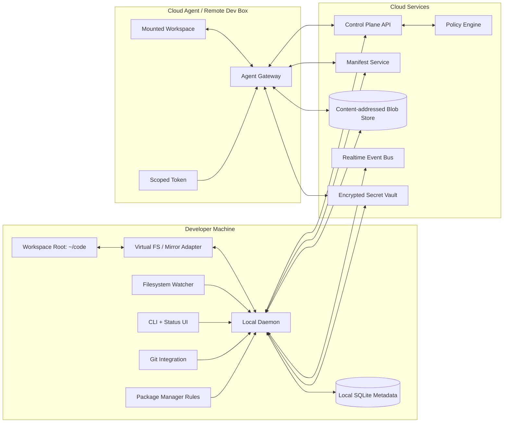
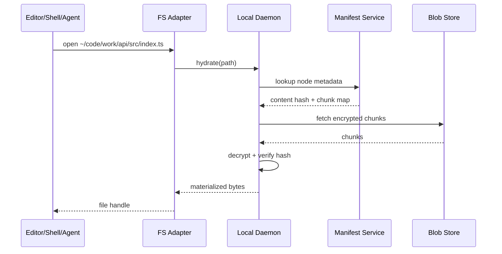
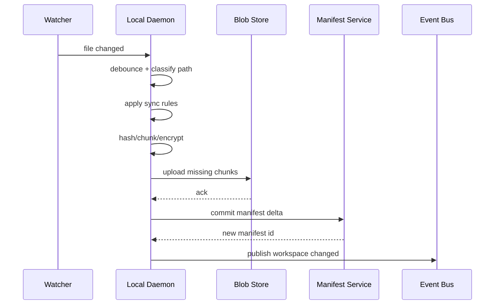

# Architecture: Dropbox for Devs

## 1. Product summary

**Dropbox for Devs** is a developer-focused workspace sync system that keeps a user's `~/code` directory consistent across laptops, desktops, home servers, CI runners, and cloud agents.

It is not a replacement for Git. Git remains the source-control layer for project history, review, branching, and collaboration. Dropbox for Devs manages the **developer workspace layer**: where repositories live, which projects exist, which files are locally materialized, which machine has what state, which environment/config files are available, and how agents can safely spin up with the same project layout as the human developer.

The core user experience:

```text
~/code
  personal/
    blog/
    tiny-cli/
  work/
    api/
    web/
    infra/
  experiments/
    agent-prototype/
```

That tree appears on every enrolled machine. Directories and metadata are visible immediately. File contents are fetched lazily when opened, listed, searched, built, or touched. Generated artifacts and platform-specific dependency folders are ignored or rehydrated locally according to dev-aware rules.

## 2. Problem statement

Developers increasingly work across multiple machines and agent environments. A single project may be touched from a laptop, desktop, home server, remote Linux box, and short-lived cloud agent. Existing tools do not solve the full workspace problem:

- Dropbox/Google Drive sync files, but are not aware of Git repos, package managers, generated folders, secrets, OS-specific artifacts, or agent workflows.
- Git syncs repository history, but does not answer: "Where are all my repos?", "Do all my machines have the same directory layout?", "Which machine has the latest local-only config?", or "Can my cloud agent see the same workspace shape without downloading everything?"
- Dotfile managers and secret managers solve narrow parts of the problem but do not create a unified, lazy, cross-machine developer namespace.
- Worktrees, local clones, `.env` files, build artifacts, and package-manager caches create machine-local state that developers constantly recreate by hand.

Dropbox for Devs provides a single, developer-aware filesystem namespace that spans local and remote compute.

## 3. Goals

1. **One canonical code folder**
   - A user chooses one workspace root such as `~/code`.
   - The same folder structure appears on every enrolled machine and agent.

2. **Lazy hydration**
   - New machines get the namespace immediately.
   - File content is fetched on demand.
   - Large repos, old experiments, logs, and artifacts do not need to be fully downloaded.

3. **Dev-aware sync rules**
   - Default rules understand common generated folders: `node_modules`, `.next`, `dist`, `target`, `.venv`, `__pycache__`, `vendor`, `build`, `.turbo`, `.cache`, etc.
   - Rules are configurable per workspace, repo, folder, OS, architecture, and machine class.

4. **Git-aware, not Git-replacing**
   - Detect repos, remotes, branches, dirty state, staleness, and unpushed commits.
   - Warn when a machine or agent starts from stale `main`.
   - Never silently mutate Git history.

5. **Safe secrets and config sync**
   - `.env` and similar files can be synced through an encrypted policy layer.
   - Secrets can be scoped by repo, machine, user, environment, and agent permission.
   - Raw secrets are never stored unencrypted in the control plane.

6. **Agent-ready workspaces**
   - Agents can mount the same namespace.
   - Agents can hydrate only the files they inspect or modify.
   - Agents receive explicit, auditable permissions for repos, secrets, commands, and write scopes.

7. **Offline-first local development**
   - A developer can continue working without network access on already-hydrated files.
   - Changes queue locally and sync when connectivity returns.

8. **Conflict safety**
   - Conflicts are preserved, visible, and recoverable.
   - The system never silently overwrites unsynced local work.

## 4. Non-goals

- Replacing Git, GitHub, GitLab, or code review.
- Being a generic consumer file sync product.
- Syncing every byte by default.
- Syncing OS-specific dependency directories across incompatible platforms.
- Solving package installation, build caching, or CI orchestration in v1.
- Providing production secret rotation as a full replacement for tools like 1Password, Doppler, Vault, or cloud secret managers.

## 5. Design principles

1. **The namespace is primary; bytes are secondary.**
   Users should see the complete project tree before every file is downloaded.

2. **Local filesystem compatibility first.**
   Existing editors, shells, Git, package managers, test runners, and agents should work against normal-looking paths.

3. **Never sync obvious junk by accident.**
   Generated folders should be ignored unless explicitly opted in.

4. **Make state legible.**
   Users should know whether a file is local, remote-only, syncing, conflicted, ignored, encrypted, or stale.

5. **Prefer explicit safety over magic.**
   Secrets, destructive deletes, agent writes, and cross-device conflict resolution require clear policy.

6. **Keep the local fast path local.**
   Opening already-hydrated files, scanning local metadata, and checking workspace status should not require a network round trip.

## 6. High-level architecture



## 7. Core components

### 7.1 Local daemon

A long-running process on each enrolled machine.

Responsibilities:

- Maintains the local workspace index.
- Watches for filesystem changes.
- Computes file hashes and chunk hashes.
- Uploads local changes.
- Downloads remote changes.
- Handles lazy hydration requests.
- Applies sync rules.
- Tracks conflicts.
- Exposes local API for CLI, tray/menu-bar UI, editor integrations, and agent tools.

Recommended implementation:

- Language: Rust or Go.
- Local metadata: SQLite.
- Watchers:
  - macOS: FSEvents.
  - Linux: inotify/fanotify.
  - Windows: ReadDirectoryChangesW.
- Local API: Unix socket / named pipe with gRPC or JSON-RPC.

### 7.2 Filesystem adapter

Two implementation modes are supported.

#### Mode A: Mirror mode, v1-friendly

The workspace is a real directory. The daemon writes placeholders, metadata sidecars, and hydrated files directly into the filesystem.

Pros:

- Easier to implement.
- Fewer OS-level permissions.
- Works without kernel extensions or FUSE.
- Lower risk for first release.

Cons:

- Harder to intercept reads for perfect lazy hydration.
- Placeholders can confuse tools.
- Requires explicit hydration commands or shell/editor integrations for some flows.

#### Mode B: Virtual filesystem mode, target architecture

The workspace is mounted through a virtual filesystem layer.

Options:

- macOS: macFUSE or File Provider Extension.
- Linux: FUSE.
- Windows: Projected File System or WinFsp.

Pros:

- True on-open hydration.
- Clean remote-only file representation.
- Better status metadata.
- Better control over generated artifacts and ignored paths.

Cons:

- More complex implementation.
- OS-specific behavior.
- Requires careful performance and reliability work.

Recommendation: ship v1 with mirror mode plus explicit hydration, then graduate hot paths to virtual filesystem mode.

### 7.3 Manifest service

Stores and serves the workspace tree as a versioned Merkle DAG.

Responsibilities:

- Path-to-node lookup.
- Directory listing.
- Version history.
- Device state tracking.
- Conflict lineage.
- Tombstones for deletes.
- Efficient diff generation between local and remote state.

The manifest service should not store raw file bytes. It stores metadata and content hashes.

### 7.4 Blob store

Content-addressed storage for file chunks and small-file blobs.

Responsibilities:

- Deduplicate identical content across devices and versions.
- Store encrypted chunks.
- Support resumable upload and download.
- Support range reads for large files.
- Support garbage collection after retention windows.

Blob IDs should be derived from encrypted or plaintext content depending on the privacy model. For stronger privacy, use client-side encryption and avoid global cross-user deduplication.

### 7.5 Control plane API

Coordinates users, devices, workspaces, access tokens, policy, billing, and service discovery.

Responsibilities:

- User and org auth.
- Device enrollment.
- Workspace membership.
- Agent token minting.
- Policy evaluation.
- Audit log reads.
- Manifest and blob endpoint discovery.

### 7.6 Event bus

A low-latency notification layer for sync events.

Responsibilities:

- Notify devices that workspace versions changed.
- Notify agents when files they depend on changed.
- Broadcast conflict events.
- Wake lazy clients without requiring aggressive polling.

Potential transports:

- WebSockets for clients.
- NATS, Kafka, or managed pub/sub internally.

### 7.7 Secret vault

Encrypted storage for `.env`, credentials, tokens, and private config.

Responsibilities:

- Client-side encryption of secret values.
- Per-device and per-agent access grants.
- Scoped secret materialization.
- Audit logs for secret reads.
- Optional shell injection without writing secrets to disk.

The vault is a first-class component because a key motivation is safely moving environment/config state across machines.

### 7.8 Policy engine

Evaluates whether a user, device, or agent may read, write, hydrate, delete, execute, or access secrets.

Inputs:

- User identity.
- Device identity and posture.
- Workspace membership.
- Repo path.
- File classification.
- Secret scope.
- Agent token claims.
- Requested operation.

Outputs:

- Allow/deny.
- Redaction rules.
- Audit requirements.
- Required confirmation.

### 7.9 Agent gateway

A constrained interface for cloud agents and remote dev boxes.

Responsibilities:

- Mount a workspace namespace for an agent.
- Hydrate files on demand.
- Enforce read/write scopes.
- Expose repo status and sync status to the agent.
- Prevent accidental whole-workspace downloads.
- Provide explicit APIs for secrets, command execution metadata, and writeback.

Agent workspaces should use short-lived scoped tokens and should be disposable.

## 8. Data model

### 8.1 Workspace

```ts
type Workspace = {
  id: string;
  ownerId: string;
  name: string;
  rootName: string; // e.g. "code"
  createdAt: string;
  currentManifestId: string;
  defaultSyncProfileId: string;
};
```

### 8.2 Node

A node is a file, directory, symlink, repo boundary, secret placeholder, or virtual/generated marker.

```ts
type Node = {
  id: string;
  workspaceId: string;
  parentId: string | null;
  name: string;
  path: string;
  kind: "file" | "directory" | "symlink" | "repo" | "secret" | "virtual";
  mode: number;
  size: number;
  contentHash?: string;
  manifestId: string;
  createdAt: string;
  modifiedAt: string;
  deletedAt?: string;
  attributes: Record<string, string>;
};
```

### 8.3 Blob

```ts
type Blob = {
  hash: string;
  size: number;
  chunkCount: number;
  encryption: "none" | "client-v1";
  compression: "none" | "zstd";
};
```

### 8.4 Device

```ts
type Device = {
  id: string;
  userId: string;
  name: string;
  os: "macos" | "linux" | "windows";
  arch: "arm64" | "x64";
  trustLevel: "personal" | "work" | "ephemeral" | "untrusted";
  lastSeenAt: string;
  publicKey: string;
};
```

### 8.5 Sync rule

```ts
type SyncRule = {
  id: string;
  workspaceId: string;
  pattern: string;
  action: "sync" | "ignore" | "metadata-only" | "local-only" | "secret" | "hydrate-on-access";
  os?: Array<"macos" | "linux" | "windows">;
  arch?: Array<"arm64" | "x64">;
  priority: number;
};
```

### 8.6 Agent workspace

```ts
type AgentWorkspace = {
  id: string;
  workspaceId: string;
  agentProvider: string;
  tokenId: string;
  rootPath: string;
  readScopes: string[];
  writeScopes: string[];
  secretScopes: string[];
  expiresAt: string;
};
```

## 9. Sync semantics

### 9.1 File states

Each local path has one of the following states:

| State | Meaning |
|---|---|
| `local` | Fully hydrated and current. |
| `remote-only` | Metadata is present, bytes are not local. |
| `hydrating` | Download is in progress. |
| `uploading` | Local changes are being uploaded. |
| `dirty` | Local changes exist and are not yet synced. |
| `ignored` | Path is intentionally excluded by policy. |
| `metadata-only` | Directory entry exists but content is not synced. |
| `secret-locked` | Secret exists but is not materialized for this device/session. |
| `conflicted` | Concurrent edits require user or policy resolution. |
| `stale-repo` | Git repo is behind configured upstream/base. |

### 9.2 Manifest-first sync

When a device joins or reconnects:

1. Authenticate device.
2. Fetch workspace metadata.
3. Fetch latest manifest root.
4. Diff local SQLite index against manifest.
5. Materialize directory structure and remote-only placeholders.
6. Download file contents only for pinned, recently used, or policy-required paths.

### 9.3 Lazy hydration

A file is hydrated when:

- User opens it in editor.
- Shell command reads it.
- Agent requests it.
- `devdrop hydrate <path>` is run.
- Policy pins it.
- A prefetch heuristic predicts it will be needed.

Hydration flow:



### 9.4 Upload flow



### 9.5 Delete semantics

Deletes create tombstones, not immediate hard deletes.

Default retention:

- Local undo window: 24 hours.
- Remote tombstone retention: 30 days.
- Org-configurable retention for teams.

Dangerous deletes require confirmation when they affect:

- Many files.
- Pinned paths.
- Repos with unpushed commits.
- Secret files.
- Paths modified by another device recently.

## 10. Dev-aware ignore and materialization rules

### 10.1 Rule file

Each workspace may include a root-level `.devsyncignore` file.

Example:

```gitignore
# Dependency folders should not sync across OSes
node_modules/       metadata-only package-manager=npm
.pnpm-store/        local-only
.venv/              local-only
vendor/             metadata-only package-manager=go

# Build outputs
.next/              ignore
.turbo/             ignore
dist/               ignore
build/              ignore
target/             local-only

# Caches
.cache/             ignore
__pycache__/        ignore
*.pyc               ignore

# Secrets
.env                secret scope=repo
.env.*              secret scope=repo
!.env.example       sync

# Logs and temp files
*.log               ignore
tmp/                ignore
```

The rule language should be compatible with `.gitignore` patterns but add actions and attributes.

### 10.2 Default global rules

The product ships with default rules for common ecosystems:

- JavaScript/TypeScript: `node_modules`, `.next`, `.nuxt`, `.turbo`, `.vite`, `dist`.
- Python: `.venv`, `venv`, `__pycache__`, `.pytest_cache`, `.mypy_cache`.
- Rust: `target`.
- Go: module cache awareness, `vendor` policy.
- Java/Kotlin: `build`, `.gradle`, `target`.
- Swift/iOS: `DerivedData`, `.build`.
- General: logs, temp folders, OS metadata files.

### 10.3 Platform-aware folders

Some folders should be recreated per OS/architecture instead of synced.

Example:

```yaml
node_modules:
  action: local-only
  reason: native packages may differ by OS and architecture
  restore: npm install | pnpm install | yarn install | bun install
```

The daemon can surface this as:

```text
~/code/work/web/node_modules is local-only.
Run: pnpm install
```

In later versions, it can trigger package-manager restores automatically after user approval.

## 11. Git integration

Dropbox for Devs is Git-aware so it can prevent stale, unsafe, or confusing local workspace states.

### 11.1 Repo detection

The daemon detects:

- `.git` directories.
- Git worktrees.
- Bare repos.
- Submodules.
- Nested repos.
- Remote URLs.
- Current branch.
- HEAD commit.
- Dirty state.
- Untracked files.
- Unpushed commits.
- Upstream staleness.

### 11.2 Repo status metadata

Example status:

```json
{
  "path": "~/code/work/api",
  "remote": "git@github.com:company/api.git",
  "branch": "main",
  "head": "abc123",
  "upstream": "origin/main",
  "behind": 3,
  "ahead": 0,
  "dirty": false,
  "lastFetchAt": "2026-06-23T09:41:00Z"
}
```

### 11.3 Stale-base protection

When a user or agent starts work in a repo:

1. Check whether the repo is behind its configured base branch.
2. Warn if stale.
3. Optionally auto-fetch.
4. Optionally block agent writes until refreshed.

Example CLI output:

```text
warning: ~/code/work/api is 17 commits behind origin/main.
Run `devdrop repo update ~/code/work/api` before creating a worktree or starting an agent.
```

### 11.4 What syncs in Git repos?

By default:

- Source files sync according to workspace rules.
- `.git` object databases do **not** sync as normal files.
- Git metadata is summarized and synced as structured metadata.
- Local branches may be advertised across devices but not force-created unless opted in.
- Uncommitted changes can sync as workspace changes, but the UI should label them clearly as uncommitted local state.

This avoids corrupting repos while still allowing a developer to resume work on another machine.

## 12. Secrets architecture

### 12.1 Secret classification

The following paths are secrets by default:

- `.env`
- `.env.*`
- `*.pem`
- `*.key`
- `id_rsa`, `id_ed25519`
- files matched by user/org policy

Secrets are represented in the namespace as secret nodes.

### 12.2 Encryption model

Recommended model:

- Each workspace has a workspace data key.
- Each secret has a secret data key.
- Secret values are encrypted client-side.
- Device public keys wrap workspace/secret keys for authorized devices.
- Agent tokens receive access only to explicitly granted secret scopes.

The service should not be able to read plaintext secrets.

### 12.3 Materialization modes

| Mode | Behavior |
|---|---|
| `file` | Writes decrypted secret to disk at the expected path. |
| `tmpfs` | Writes decrypted secret to temporary memory-backed storage when available. |
| `env-inject` | Injects variables into a command without writing a file. |
| `locked` | Shows placeholder only; requires unlock. |

Example:

```bash
devdrop run --repo work/api --secret-scope dev -- npm test
```

The daemon decrypts the needed `.env` values and injects them only for that process.

## 13. Agent architecture

Agents are first-class clients, but they are more constrained than human devices.

### 13.1 Agent workspace lifecycle

1. User starts an agent for a repo or task.
2. Control plane creates an `AgentWorkspace` with scoped permissions.
3. Agent mounts the workspace through the Agent Gateway.
4. Agent sees the same path layout as the user.
5. Agent hydrates files on read.
6. Agent writes changes to a scoped overlay.
7. User reviews and accepts, rejects, or converts the overlay into real workspace changes.
8. Workspace expires and is garbage-collected.

### 13.2 Overlay writes

Agent writes should land in an overlay by default.

Benefits:

- Prevents accidental mutation of the user's live workspace.
- Makes review easy.
- Enables multiple agents to work on the same repo concurrently.
- Allows rollback by dropping the overlay.

Overlay states:

- `pending`
- `accepted`
- `rejected`
- `merged`
- `expired`

### 13.3 Agent-safe APIs

Agents should not rely only on raw shell commands. Provide explicit APIs:

```bash
devdrop status --json
devdrop hydrate src/index.ts
devdrop repo-status --json
devdrop secret request .env --scope dev
devdrop overlay diff
devdrop overlay submit
```

These commands are machine-readable and safer than parsing arbitrary sync status text.

## 14. Conflict handling

### 14.1 Conflict detection

A conflict occurs when:

- Two devices modify the same file from the same base version.
- A file is modified on one device and deleted on another.
- A secret value changes in two places.
- A path is renamed differently on two devices.
- An agent overlay modifies a file that changed upstream before acceptance.

### 14.2 Conflict representation

Conflicts should be explicit nodes, not hidden side effects.

Example:

```text
src/config.ts
src/config (conflict from Mac Mini 2026-06-23 10-41).ts
```

The manifest records both parents and both device authors.

### 14.3 Auto-merge policy

Auto-merge may be allowed for:

- Plain text files with non-overlapping edits.
- JSON/YAML/TOML with parseable structural merges.
- Lockfiles only when package-manager-specific merge strategy succeeds.

Auto-merge should be disabled by default for:

- Secrets.
- Binary files.
- Git internals.
- Generated artifacts.
- Files above a size threshold.

## 15. Local metadata schema

SQLite tables:

```sql
CREATE TABLE nodes (
  id TEXT PRIMARY KEY,
  workspace_id TEXT NOT NULL,
  parent_id TEXT,
  path TEXT NOT NULL,
  kind TEXT NOT NULL,
  mode INTEGER,
  size INTEGER,
  content_hash TEXT,
  local_state TEXT NOT NULL,
  remote_manifest_id TEXT,
  local_mtime INTEGER,
  remote_mtime INTEGER,
  deleted_at INTEGER,
  UNIQUE(workspace_id, path)
);

CREATE TABLE blobs (
  hash TEXT PRIMARY KEY,
  size INTEGER NOT NULL,
  local_path TEXT,
  present INTEGER NOT NULL DEFAULT 0,
  ref_count INTEGER NOT NULL DEFAULT 0
);

CREATE TABLE sync_rules (
  id TEXT PRIMARY KEY,
  workspace_id TEXT NOT NULL,
  pattern TEXT NOT NULL,
  action TEXT NOT NULL,
  priority INTEGER NOT NULL
);

CREATE TABLE repo_status (
  node_id TEXT PRIMARY KEY,
  remote_url TEXT,
  branch TEXT,
  head TEXT,
  upstream TEXT,
  ahead INTEGER,
  behind INTEGER,
  dirty INTEGER,
  last_fetch_at INTEGER
);

CREATE TABLE operations (
  id TEXT PRIMARY KEY,
  workspace_id TEXT NOT NULL,
  op_type TEXT NOT NULL,
  path TEXT NOT NULL,
  payload_json TEXT NOT NULL,
  status TEXT NOT NULL,
  created_at INTEGER NOT NULL,
  updated_at INTEGER NOT NULL
);
```

## 16. API sketch

### 16.1 Control plane

```http
POST /v1/devices/enroll
GET  /v1/workspaces
POST /v1/workspaces
GET  /v1/workspaces/:id/policy
POST /v1/agents/workspaces
GET  /v1/audit/events
```

### 16.2 Manifest service

```http
GET  /v1/workspaces/:id/manifest/latest
GET  /v1/manifests/:manifestId/nodes?path=/work/api
POST /v1/workspaces/:id/manifest/commit
POST /v1/workspaces/:id/manifest/diff
```

### 16.3 Blob service

```http
POST /v1/blobs/batch/exists
POST /v1/blobs/batch/upload
GET  /v1/blobs/:hash
GET  /v1/blobs/:hash/chunks/:index
```

### 16.4 Secret vault

```http
GET  /v1/workspaces/:id/secrets?path=/work/api/.env
POST /v1/workspaces/:id/secrets
POST /v1/workspaces/:id/secrets/:secretId/grants
POST /v1/workspaces/:id/secrets/:secretId/decrypt-session
```

## 17. CLI design

Primary binary: `devdrop`.

### 17.1 Setup

```bash
devdrop login
devdrop workspace init ~/code
devdrop device enroll "MacBook Pro"
devdrop sync
```

### 17.2 Daily use

```bash
devdrop status
devdrop ls ~/code/work
devdrop hydrate ~/code/work/api
devdrop pin ~/code/work/api
devdrop unpin ~/code/experiments/old-project
devdrop ignored ~/code/work/web
devdrop conflicts
devdrop repo-status
devdrop doctor
```

### 17.3 Secrets

```bash
devdrop secret add ~/code/work/api/.env --scope dev
devdrop secret unlock ~/code/work/api/.env
devdrop secret lock ~/code/work/api/.env
devdrop run --repo ~/code/work/api --secret-scope dev -- pnpm test
```

### 17.4 Agents

```bash
devdrop agent create --repo ~/code/work/api --write-scope src/** --secret-scope test
devdrop agent status
devdrop agent diff <agent-id>
devdrop agent accept <agent-id>
devdrop agent reject <agent-id>
```

## 18. Editor and shell integrations

### 18.1 Editor integrations

- VS Code extension.
- Cursor/Windsurf extension.
- JetBrains plugin.
- Neovim plugin.

Features:

- Hydration status badges.
- Conflict markers.
- Secret locked/unlocked indicators.
- Stale repo warnings.
- Agent overlay diffs.
- One-click hydrate/pin.

### 18.2 Shell integrations

- Prompt segment showing workspace status.
- `cd` hook to hydrate directory metadata.
- Warning when entering stale repos.
- Completion for remote-only paths.

Example prompt:

```text
~/code/work/api main⇣3 devdrop:remote-only(421) dirty(2)
```

## 19. Performance design

### 19.1 Hot paths

Must be fast:

- Listing a directory.
- Opening a hydrated file.
- Checking sync status.
- Applying local filesystem events.
- Computing small diffs.
- Starting an agent workspace.

### 19.2 Performance targets

| Operation | Target |
|---|---:|
| List hydrated directory with 1k entries | < 50 ms |
| List remote-only directory with cached manifest | < 100 ms |
| Open hydrated file | Same as local filesystem + < 5 ms overhead |
| Hydrate 100 KB file | < 300 ms on normal broadband |
| Enroll new device into 100k-file workspace metadata | < 60 s |
| CLI `status` on 100k-file workspace | < 2 s |

### 19.3 Prefetch heuristics

Prefetch when:

- User opens a repo root.
- Editor opens a project folder.
- User runs `git status`, `pnpm install`, `npm test`, `cargo test`, etc.
- Agent reads dependency manifests.
- A file imports nearby files.

Avoid prefetching:

- Large binary assets.
- Ignored/generated folders.
- Old projects unless pinned.
- Secrets without active unlock.

## 20. Security model

### 20.1 Trust boundaries

- Local device is trusted only after enrollment.
- Cloud control plane is trusted for coordination, not plaintext secrets.
- Blob store is untrusted for plaintext confidentiality.
- Agents are least-privilege, short-lived clients.
- Other devices may be compromised, so destructive operations need auditability and recovery.

### 20.2 Device enrollment

Enrollment flow:

1. User authenticates.
2. Device generates keypair locally.
3. Control plane stores public key.
4. Existing trusted device or user session approves access.
5. Workspace keys are wrapped to new device.
6. Device begins manifest sync.

### 20.3 Audit events

Audit every:

- Device enrollment.
- Secret read/decrypt.
- Agent workspace creation.
- Agent secret grant.
- Bulk delete.
- Conflict resolution.
- Policy change.
- Workspace export.

### 20.4 Ransomware and destructive sync protection

Protections:

- Rate-limit mass deletes and mass rewrites.
- Detect unusual file churn.
- Keep version history and tombstones.
- Require confirmation for destructive operations above thresholds.
- Allow per-device quarantine.
- Provide workspace rollback by time/version.

## 21. Reliability and consistency

### 21.1 Consistency model

Use eventual consistency with strong per-file version checks.

- Devices can edit offline.
- Manifest commits use compare-and-swap against known base versions.
- Conflicts are created when base versions diverge.
- Directory renames are tracked as node ID moves, not just path delete/create.

### 21.2 Operation log

The daemon records local operations before executing remote sync.

Benefits:

- Crash recovery.
- Retry support.
- User-visible progress.
- Debugging.

Operation example:

```json
{
  "id": "op_123",
  "type": "write_file",
  "path": "/work/api/src/index.ts",
  "baseNodeVersion": "v10",
  "newContentHash": "sha256:...",
  "status": "pending_upload"
}
```

### 21.3 Background sync scheduler

Priority order:

1. User-opened files.
2. Active editor project.
3. Active shell working directory.
4. Agent-requested files.
5. Pinned repos.
6. Recently used files.
7. Low-priority background hydration.

## 22. Observability

### 22.1 Local diagnostics

`devdrop doctor` should check:

- Daemon health.
- Watcher health.
- SQLite integrity.
- Filesystem adapter status.
- Network connectivity.
- Auth token validity.
- Manifest lag.
- Blob upload/download errors.
- Git integration issues.
- Conflicts.
- Secret unlock state.

### 22.2 Metrics

Local metrics:

- Hydration latency.
- Upload latency.
- Event queue depth.
- Watcher backlog.
- Conflict count.
- Bytes uploaded/downloaded.
- Ignored bytes saved.
- Blob cache hit rate.

Cloud metrics:

- Manifest commit latency.
- Blob availability.
- Event delivery latency.
- Agent workspace creation latency.
- Secret decrypt session count.
- API error rates.

## 23. MVP scope

### 23.1 MVP features

- Single-user workspace.
- macOS and Linux support.
- Mirror mode, not full virtual filesystem.
- Local daemon with SQLite.
- Manifest-first sync.
- Content-addressed blob storage.
- Basic `.devsyncignore` support.
- Default generated-folder ignore rules.
- Manual hydration and pinning.
- Git repo detection and stale-base warnings.
- Encrypted `.env` sync for trusted devices.
- CLI-only UX.

### 23.2 MVP exclusions

- Windows support.
- Full FUSE/macFUSE implementation.
- Team/org sharing.
- Advanced agent overlays.
- Automatic package-manager restore.
- Structural merge engine.
- Mobile apps.
- Complex enterprise policy.

## 24. Phased roadmap

### Phase 0: Prototype

Goal: prove workspace metadata sync and lazy-ish hydration.

Build:

- CLI.
- Local daemon.
- SQLite index.
- Local filesystem watcher.
- Remote manifest API.
- Local object store or S3-compatible blob store.
- `.devsyncignore` parser.
- Manual `hydrate`, `pin`, `status` commands.

### Phase 1: Useful single-user product

Goal: use it across two personal machines.

Build:

- Auth and device enrollment.
- Encrypted blob upload/download.
- Better conflict detection.
- Git-aware repo status.
- Stale branch warnings.
- Secret vault for `.env`.
- Tray/menu-bar status UI.
- VS Code/Cursor extension.

### Phase 2: Agent workspaces

Goal: cloud agents can mount and work in the same namespace safely.

Build:

- Agent Gateway.
- Short-lived scoped tokens.
- Overlay writes.
- Agent diff/submit/accept workflow.
- Agent-safe CLI JSON APIs.
- Secret scopes for agents.

### Phase 3: Virtual filesystem

Goal: true Dropbox-like on-access hydration.

Build:

- macOS filesystem adapter.
- Linux FUSE adapter.
- Remote-only placeholders.
- Transparent open/read hydration.
- Better prefetching.
- Editor-independent UX.

### Phase 4: Teams and orgs

Goal: shared workspaces for engineering teams.

Build:

- Org workspaces.
- Role-based access control.
- Team policy templates.
- Shared repo registry.
- Audit dashboard.
- Ransomware rollback tools.
- Admin-managed sync rules.

## 25. Open questions

1. Should uncommitted source changes sync by default inside Git repos, or should users explicitly enable this per repo?
2. Should `.git` metadata ever be synced, or should Git state always be reconstructed from remotes plus structured metadata?
3. What is the right UX for `.env` files: materialized files, env injection, or both?
4. How much should the product automate package-manager restores?
5. Should the virtual filesystem be required for the core experience, or can mirror mode remain the default?
6. How should agent overlays map to Git branches, patches, or pull requests?
7. What retention period balances recovery with storage cost?
8. Can a generic rule language handle all ecosystems, or are package-manager plugins required?

## 26. Major risks

| Risk | Impact | Mitigation |
|---|---|---|
| Filesystem adapter complexity | Product is unreliable or OS-specific | Start with mirror mode; add VFS later. |
| Accidental secret leakage | Severe trust failure | Client-side encryption, locked-by-default secrets, audit logs. |
| Git repo corruption | Data loss | Never sync `.git` as ordinary files; use structured Git metadata. |
| Generated artifact explosion | High storage and slow sync | Strong default ignore rules and size/churn detection. |
| Confusing conflict UX | User loses confidence | Make conflicts explicit, recoverable, and visible in CLI/editor. |
| Agent over-permissioning | Security exposure | Short-lived scoped tokens and overlay writes by default. |
| Cross-platform path issues | Broken workspace portability | Normalize paths, preserve case metadata, test OS-specific behavior. |
| Performance on huge repos | Unusable at scale | Manifest DAG, chunked blobs, lazy hydration, prioritization. |

## 27. Reference user stories

### 27.1 New machine setup

As a developer, I enroll a new Linux box and run:

```bash
devdrop workspace mount ~/code
```

Within seconds, I can see all my projects. When I `cd ~/code/work/api`, the repo metadata appears. When I open `src/index.ts`, that file hydrates. When I run tests, required source files hydrate as needed, while `node_modules` remains local-only until I install dependencies.

### 27.2 Avoid stale agent work

As a developer, I start an agent on `work/api`. The system notices that the repo is 12 commits behind `origin/main` and blocks the agent from writing until the base is updated or I explicitly override.

### 27.3 Sync `.env` safely

As a developer, I add `.env` to the secret vault. My personal Mac Mini can unlock it. A cloud agent can only access the `test` scope. Another machine can see that `.env` exists, but cannot read it until approved.

### 27.4 Resume work elsewhere

As a developer, I edit a file on my laptop and later sit down at my desktop. The same repo path exists, the changed file is available, and the CLI tells me whether the change is uncommitted, synced, or conflicted.

## 28. Recommended initial tech stack

### Client

- Rust daemon.
- SQLite metadata.
- Notify crate or platform-specific watchers.
- zstd compression.
- BLAKE3 or SHA-256 content hashing.
- age/libsodium/ring for encryption primitives.
- Tauri or native menu-bar app later.

### Cloud

- Postgres for control plane and manifest metadata.
- S3-compatible object storage for blobs.
- Redis/NATS for eventing.
- gRPC or HTTP/JSON APIs.
- OIDC auth.
- OpenTelemetry for tracing and metrics.

### Agent gateway

- Rust/Go service.
- Scoped JWT/PASETO tokens.
- Overlay storage in object store.
- Optional FUSE mount in agent containers.

## 29. Definition of done for v1

The product is v1-ready when a developer can:

1. Enroll two machines.
2. See the same `~/code` structure on both.
3. Add a repo on one machine and see it appear on the other.
4. Hydrate files on demand.
5. Avoid syncing `node_modules` and common build artifacts.
6. Sync an `.env` file through encrypted secret handling.
7. Receive a stale-branch warning before starting work.
8. Resolve a simple text conflict without data loss.
9. Run `devdrop doctor` and understand sync health.
10. Recover a deleted or overwritten file from version history.

## 30. Summary

Dropbox for Devs is a workspace coordination layer for modern development. It gives developers and agents a shared, lazy, secure, dev-aware code namespace without forcing every machine to fully clone, configure, and hydrate every project manually.

The key architectural bet is that the system should sync **workspace intent and structure first**, then hydrate bytes only when useful. Git remains the history and collaboration layer; Dropbox for Devs becomes the always-present developer workspace layer that makes every machine and agent feel like it already has the user's codebase.
